# improve-coverage

An agent skill that raises test coverage on a scope you
choose. It interviews you about the scope, measures
coverage, sends one agent per uncovered file to write that
file's tests, and reports the real number. A calling skill
can pass the scope instead of the interview. The skill is
one `SKILL.md` and no program. One agent run of it under
each client, on one synthetic fixture, is recorded under
[Agent invocations](#agent-invocations).

Worked example, by hand: shapes.py 57% to 100%, tests only.

<picture>
  <source
    media="(prefers-reduced-motion: reduce)"
    srcset="assets/poster.svg"
  />
  
</picture>

The demo is reconstructed from
[`evidence/transcripts/worked-example.txt`](evidence/transcripts/worked-example.txt),
which [`scripts/record_session.py`](scripts/record_session.py)
recorded. It shows a person following the skill's
non-interactive mode from a shell, not an agent running the
skill.

**Not measured, stated up front.**

- The worked example is seven shell commands on a synthetic
  repository. Its one new test file was written by hand for
  the example; in a real run an agent writes it.
- Whether an agent that reads `SKILL.md` follows the
  interview, or stops when a caller passes only one of the
  two inputs, has not been measured.
- The example covers line coverage of one Python file,
  measured by a stand-in coverage command built on the
  standard library's `trace` module. Branch coverage, the
  fan-out (Step 3), the type-check and lint pass (Step 4),
  review (Step 6) and commits (Steps 7 and 8) were not
  exercised.
- Neither install block below was run in a Claude Code or
  Codex session.

## What the claim covers

The claim is about the worked example, not about the skill
working. In it, a caller's inputs name a diff base;
`git diff --name-only base` lists `shapes.py` and leaves out
the untouched `units.py`; the repository's coverage command
reports that 4 of 7 lines of `shapes.py` ran (57%) and lists
the three that did not; one test file is copied in; the same
command reports 7 of 7 (100%); and `git status --short`
shows only the new test file. The commands stand in for
what the skill asks an agent to do in non-interactive mode:
take the caller's scope, measure it (Step 2), add tests for
the uncovered lines (Step 3) and measure again, without
touching production code.

## What is in it

[`skills/improve-coverage/SKILL.md`](skills/improve-coverage/SKILL.md)
is the skill. In order:

- **Core principles**: interview until the scope is
  settled, write test code only, and work toward 100%.
- **Non-interactive mode**: how a calling skill passes the
  scope and the coverage command so the interview is
  skipped (see below).
- **Steps 1 to 9**: the scope interview, an honest
  measurement, one agent per uncovered file, a full-suite
  type-check and lint pass, handling of code no test can
  reach, a review by fresh agents, a commit plan, the
  commits, and a summary table.
- **Honesty rules**: report the real aggregate and which
  gates ran.

[`skills/improve-coverage/agents/openai.yaml`](skills/improve-coverage/agents/openai.yaml)
is the Codex interface file.

## Non-interactive mode

With neither input passed, the skill starts with the
interview, as before. A caller that already knows the scope
passes `scope` (a list of production files, or a diff base)
and `coverage_cmd` (the coverage command it runs), and may
pass `target`, `exclusions` and `commit`. The interview is
then skipped. If only one of `scope` and `coverage_cmd` is
passed, or the scope is empty, `SKILL.md` tells the agent to
stop and say which input is missing, without starting the
interview. The inputs are free text in the caller's
request; `SKILL.md` shows an example, and the worked example
below uses one.

In this mode `SKILL.md` tells the agent not to edit
production files for any reason, comments and
coverage-ignore directives included, not to commit unless
`commit` allows it, not to push, and to return the summary
table to the caller.

`swe-day`
([trycopilotai/swe-day](https://github.com/trycopilotai/swe-day))
is the caller this mode was added for: at its step 10 it
runs this skill on the production code changed that day.
At its v0.1.9, swe-day's step 10 text still says to
interview the operator about scope; it does not yet pass
the inputs above.

## Not included

The skill names three other skills from the same series.
None ships here, and nothing in `SKILL.md` checks whether
one is installed. They are being released at the same time
as this one, so a repository named here may not exist
until they are:

- `multi-persona-code-review`, published as
  `trycopilotai/multi-persona-code-review`, is a code review
  that writes its findings into the source as review
  markers (Step 6).
- `address-comments`, published as
  `trycopilotai/address-comments`, resolves those markers
  (Step 6).
- `plan-commits`, published as `trycopilotai/plan-commits`
  and called as `planCommits()`, is a commit planner
  (Step 7).

When the host has no review skill at all, `SKILL.md` tells
the agent to review the new tests with a fresh agent anyway
and say which skill was missing. It does not say what to do
when only one of the two review skills is missing.
`SKILL.md` forbids grouping the commits by hand only when
the host has a commit planner; it does not say what to do
without one.

`swe-day`, published as `trycopilotai/swe-day`, calls this
skill. This skill does not call it, and nothing changes
when it is missing.

`SKILL.md` also expects things the repository being worked
on, or the agent host, provides:

- a test runner and a coverage command. `SKILL.md` names
  neither; its coverage-provider caveat in Step 2 mentions
  V8-based and istanbul-style providers as examples;
- a type-checker and a linter, for Step 4;
- a way to run several subagents at once, for Step 3.
  `SKILL.md` does not say what to do on a host that cannot;
- a way to ask the operator structured questions, for the
  interview, when the host has one;
- `git`, when the scope is a diff base;
- optionally, a per-repository wrapper skill that binds the
  commands, the commit and privacy rules and a private run
  log. None ships here.

## What changed from the original

`SKILL.md` comes from a private repository. For this
release:

- it moved from `skill/SKILL.md` to
  `skills/improve-coverage/SKILL.md`;
- the "Non-interactive mode" section was added, and lines
  that point at it were added to the description, the
  introduction, the first two principles and Step 1;
- Step 6 named the review skills by their private
  repository paths. It now names
  `multi-persona-code-review` and `address-comments`, says
  neither ships here, and says what to do without them;
- Step 7 named the commit planner for one private set of
  repositories. It now names `plan-commits`, called as
  `planCommits()`;
- the install paragraph says to install the skill's
  directory, not to copy `skill/SKILL.md`;
- two hyphenated words split by line wrapping
  (`istanbul- style`, `coverage- ignore`) were joined.

Everything else is as it was. The original README was not
carried over; this one was written for the release.

## Use it

Read
[`skills/improve-coverage/SKILL.md`](skills/improve-coverage/SKILL.md)
before you install it. It tells an agent to run your test
and coverage commands, to dispatch other agents, to write
test files, and, when you allow it, to commit.
[`SECURITY.md`](SECURITY.md) lists what it tells an agent
to do. Both installs below are pinned to a tag rather than
to `main`.

### Claude Code

Save this as `install.sh` and run it with `sh install.sh`.
It sets `set -eu` and an `EXIT` trap, so pasting it straight
into an interactive shell will end that shell if the clone
fails.

```sh
set -eu
release=v0.1.1
install_target="$HOME/.claude/skills/improve-coverage"
install_parent="$(dirname "$install_target")"
mkdir -p "$install_parent"
install_tmp="$(mktemp -d "$install_parent/.improve-coverage.XXXXXX")"
install_stage="$install_tmp/package"
rollback_install() {
  if [ ! -e "$install_target" ]; then
    if [ -e "$install_tmp/previous" ]; then
      mv "$install_tmp/previous" "$install_target"
    fi
  fi
  rm -rf "$install_tmp"
}
trap rollback_install EXIT
git clone --quiet --depth 1 --branch "$release" \
  https://github.com/trycopilotai/improve-coverage \
  "$install_tmp/clone"
mkdir -p "$install_stage"
cp -R "$install_tmp/clone/skill/." "$install_stage/"
if [ -e "$install_target" ]; then
  mv "$install_target" "$install_tmp/previous"
fi
mv "$install_stage" "$install_target"
trap - EXIT
rm -rf "$install_tmp"
```

Invoke it as `/improve-coverage`.

### Codex

Save this one the same way. The only line that differs from
the block above is `install_target`.

```sh
set -eu
release=v0.1.1
install_target="$HOME/.agents/skills/improve-coverage"
install_parent="$(dirname "$install_target")"
mkdir -p "$install_parent"
install_tmp="$(mktemp -d "$install_parent/.improve-coverage.XXXXXX")"
install_stage="$install_tmp/package"
rollback_install() {
  if [ ! -e "$install_target" ]; then
    if [ -e "$install_tmp/previous" ]; then
      mv "$install_tmp/previous" "$install_target"
    fi
  fi
  rm -rf "$install_tmp"
}
trap rollback_install EXIT
git clone --quiet --depth 1 --branch "$release" \
  https://github.com/trycopilotai/improve-coverage \
  "$install_tmp/clone"
mkdir -p "$install_stage"
cp -R "$install_tmp/clone/skill/." "$install_stage/"
if [ -e "$install_target" ]; then
  mv "$install_target" "$install_tmp/previous"
fi
mv "$install_stage" "$install_target"
trap - EXIT
rm -rf "$install_tmp"
```

Invoke it as `$improve-coverage`.

Each block works in a temporary `.improve-coverage.*`
directory beside the target and removes it on exit. An
existing install at the target is replaced.

Both blocks copy through `skill/`, a symlink to
`skills/improve-coverage/`, so the installed directory holds
`SKILL.md` and `agents/` as real files. They assume a
checkout that keeps symlinks; with `core.symlinks` off the
copy fails and the block rolls back. The repository also
carries `.claude-plugin/plugin.json` and
`.codex-plugin/plugin.json` for a marketplace. No
marketplace lists this skill, so no marketplace install is
described here.

## Evidence

`evidence/transcripts/worked-example.txt` is the recorded
session behind the claim at the top of this file.
`scripts/record_session.py` builds the synthetic repository
in a throwaway directory: two commits, the first tagged
`base`, holding `shapes.py`, `units.py`, one test and
`measure.py`, the repository's coverage command. The second
commit adds a triangle branch to `shapes.py`. The script
then runs the seven commands listed in
`evidence/demo-manifest.json` and writes each `$` line, the
command's output and its exit status. The transcript is not
edited; the commands print relative paths only.

The fixture's files, including the hand-written
`test_triangle.py`, are in the script's source. The manifest
records the SHA-256 of `SKILL.md`, of `agents/openai.yaml`,
of the script and of the transcript, the commands, the
interpreter and the date, and says that no agent invoked
the skill.

This is evidence that the worked example's commands print
what the transcript shows. It is not evidence that the
skill works.

`make check` runs a suite that records the example again
and compares it with the transcript byte for byte, and ties
this file, both plugin manifests, the transcript and the
demo images to each other.

**Known limits.** `measure.py` is a stand-in written for the
example. It counts lines that start a bytecode instruction
as executable, so its counts can differ from a coverage
tool's. It reports lines only, not branches.

### Agent invocations

Each client was started once, with the v0.1.0 skill text
(unchanged in this release), on one synthetic fixture: a
small Python package whose `ledger/budget.py` gained three
untested methods after the tag `base`, a passing unittest
suite, and a line-coverage command built on the standard
library's `trace` module, like the worked example's. The
prompt passed `scope` as that diff base and `coverage_cmd`,
so both runs used non-interactive mode. No review skill or
commit planner was installed. This is one run per client,
not a benchmark.

- [`evidence/transcripts/2026-10-08-claude-code-invocation.txt`](evidence/transcripts/2026-10-08-claude-code-invocation.txt):
  Claude Code 2.1.220, invoked with `/improve-coverage`. It
  loaded the skill and raised `ledger/budget.py` from 15 of
  29 lines (51%) to 29 of 29 (100%) with tests only, left
  uncommitted. It wrote the tests itself instead of
  dispatching one agent for the file as Step 3 says. It
  named `multi-persona-code-review` and `address-comments`
  as not installed and reviewed with one fresh agent.
- [`evidence/transcripts/2026-10-08-codex-invocation.txt`](evidence/transcripts/2026-10-08-codex-invocation.txt):
  Codex 0.146.0, invoked with `$improve-coverage`. It read
  the skill, sent one sub-agent to cover the file and a
  fresh one to review, and reached the same 29 of 29 lines
  with tests only, left uncommitted. Step 6 asks the summary
  to name a missing review skill; a progress message named
  both, but its final summary does not. The
  `codex exec --json` stream it is rendered from does not
  record the sub-agents' own commands or edits.

Neither run exercised Step 5 (no unreachable line), branch
coverage (the command reports lines only), a type-checker or
linter (none configured), or Steps 7 and 8 (`commit: no`).

`scripts/render_invocation.py` wrote both from the clients'
raw output, which is not committed. It keeps each tool
call's name, arguments and status, not the tool's output,
and cuts any argument string longer than 300 characters,
marking the cut `...[N more characters]`. Its only other
edits are the ones `evidence/demo-manifest.json` declares
for each invocation: `replace-plugin-root`,
`replace-capture-root`, `replace-scratch-root`,
`replace-home` and `replace-hostname`. The manifest also
records each model, prompt and outcome and both files'
SHA-256.

## Contributing

See [`CONTRIBUTING.md`](CONTRIBUTING.md).

## Security

See [`SECURITY.md`](SECURITY.md).

## License

MIT. See [`LICENSE`](LICENSE).

## Not affiliated with GitHub or GitHub Copilot

The `trycopilotai` organisation name is not a claim of any
relationship with GitHub Copilot. This project is not
affiliated with, endorsed by, or sponsored by GitHub, Inc.
GitHub and GitHub Copilot are trademarks of GitHub, Inc.
